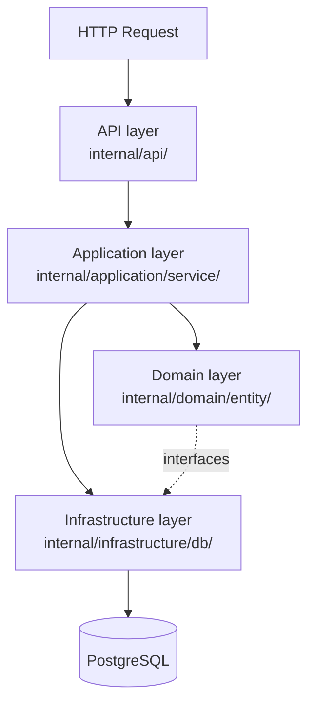

The backend is a Go HTTP API that uses the chi router and follows a clean architecture pattern. The entry point is `cmd/api/main.go`, which constructs the server and starts listening.

## Chi router and middleware

Routes are registered in `internal/server/routes.go`. The server applies two middleware layers to every request before they reach a handler.

```go
func (s *Server) RegisterRoutes() http.Handler {
    r := chi.NewRouter()
    r.Use(middleware.Logger)
    r.Use(cors.Handler(cors.Options{
        AllowedOrigins:   []string{os.Getenv("FRONTEND_ORIGIN")},
        AllowedMethods:   []string{"GET", "POST", "PUT", "DELETE", "OPTIONS", "PATCH"},
        AllowedHeaders:   []string{"Accept", "Authorization", "Content-Type"},
        AllowCredentials: true,
        MaxAge:           300,
    }))
    r.Get("/", s.HelloWorldHandler)
    r.Get("/health", s.healthHandler)
    r.Get("/health/db", s.dbHealthHandler)
    api.NewPaymentHandler(r, paymentService)
    return r
}
```

<Info>
The allowed CORS origin is read from the `FRONTEND_ORIGIN` environment variable at startup, keeping the development and production origins separate.
</Info>

| Middleware | Package | Purpose |
|---|---|---|
| `middleware.Logger` | `go-chi/chi/v5/middleware` | Logs method, path, status, and latency for every request |
| `cors.Handler` | `go-chi/cors` | Applies CORS headers and handles preflight `OPTIONS` requests |

## Layer-by-layer breakdown



### API layer — `internal/api/`

Chi HTTP handlers live here. Each handler is responsible for:

1. Decoding the request body or path parameters into a typed struct.
2. Constructing a query or mutation object.
3. Calling the appropriate application service method.
4. Mapping the returned domain entity to a response struct and writing JSON.

Shared utilities such as `WriteErrorResponse` are in `internal/api/util.go`.

### Application layer — `internal/application/`

Contains service interfaces (`interface/`), concrete service implementations (`service/`), query objects (`query/`), and mutation objects (`mutation/`). Services orchestrate business logic and depend only on the repository interfaces defined in the domain layer — they have no knowledge of HTTP or SQL.

### Domain layer — `internal/domain/`

Pure Go types with no external dependencies.

```go
// internal/domain/entity/payment.go
type Payment struct {
    ID        int32
    Sender    string
    Recipient string
    Amount    float64
    UpdatedAt time.Time
    CreatedAt time.Time
}

func NewPayment(sender string, recipient string, amount float64) *Payment
```

Repository interfaces are also declared in this layer (`internal/domain/repository/`). The infrastructure layer provides the concrete implementations.

### Infrastructure layer — `internal/infrastructure/db/`

Implements the domain repository interfaces using sqlc-generated code (`internal/generated/sqlc/`) and the `pgx/v5` PostgreSQL driver. This is the only layer that knows about SQL.

## sqlc: type-safe queries from SQL

sqlc reads SQL query files and generates Go code with fully typed function signatures. The workflow is:

<Steps>
  <Step title="Write SQL queries">
    Queries are annotated with a name and return type in `sql/query/payment.sql`.

    ```sql
    -- name: GetPayments :many
    SELECT * FROM payments ORDER BY created_at DESC;
    ```
  </Step>
  <Step title="Run sqlc generate">
    sqlc reads the query files and the schema, then emits Go source files into `internal/generated/sqlc/`.

    ```bash
    sqlc generate
    ```
  </Step>
  <Step title="Use generated functions">
    The infrastructure repositories call the generated functions, which accept typed parameters and return typed structs — no manual scanning or `interface{}` casts.

    ```go
    payment, err := s.queries.GetPaymentByID(ctx, id)
    ```
  </Step>
</Steps>

<Tip>
Because the SQL is compiled rather than constructed at runtime, sqlc catches type mismatches and missing columns at code-generation time, not at runtime.
</Tip>

## PaymentHandler routes

`api.NewPaymentHandler` mounts three routes under the `/payments` prefix.

| Method | Path | Handler | Description |
|---|---|---|---|
| `GET` | `/payments` | `GetPayments` | Returns all payments ordered by `created_at DESC` |
| `POST` | `/payments` | `CreatePayment` | Creates a new payment and returns the created record |
| `GET` | `/payments/{id}` | `GetPaymentByID` | Returns a single payment by ID |

## Request validation flow

The `CreatePayment` handler follows this sequence:

<Steps>
  <Step title="Decode request body">
    The handler decodes the JSON body into a `PaymentRequest` struct using chi's `render` package.

    ```go
    // internal/api/request/payment.go
    type PaymentRequest struct {
        Sender    string  `json:"sender"`
        Recipient string  `json:"recipient"`
        Amount    float64 `json:"amount"`
    }
    ```
  </Step>
  <Step title="Validate fields">
    The handler checks that required fields are present and that `Amount` is positive. If validation fails, `WriteErrorResponse` returns a `400 Bad Request` with a descriptive message.
  </Step>
  <Step title="Build a mutation object">
    Valid input is placed into a mutation struct from `internal/application/mutation/`. This decouples the HTTP request type from the service interface.
  </Step>
  <Step title="Call the service">
    The handler passes the mutation to the application service, which constructs a `Payment` entity using `domain.NewPayment` and persists it via the repository.
  </Step>
  <Step title="Map and respond">
    The returned domain entity is mapped to a `PaymentResponse` struct and serialized to JSON.

    ```go
    // internal/api/response/payment.go
    type PaymentReponse struct {
        ID        int       `json:"id"`
        Sender    string    `json:"sender"`
        Recipient string    `json:"recipient"`
        Amount    float64   `json:"amount"`
        UpdatedAt time.Time `json:"updatedAt"`
        CreatedAt time.Time `json:"createdAt"`
    }
    ```
  </Step>
</Steps>

## Error handling

All handlers use the `WriteErrorResponse` utility from `internal/api/util.go` to return consistent JSON error payloads. This avoids duplicating status-code logic across handlers and ensures every error response has the same shape.

<Warning>
Handlers must not write a response body after calling `WriteErrorResponse`. Doing so causes a "superfluous response.WriteHeader call" warning from the Go HTTP server because the headers have already been sent.
</Warning>
