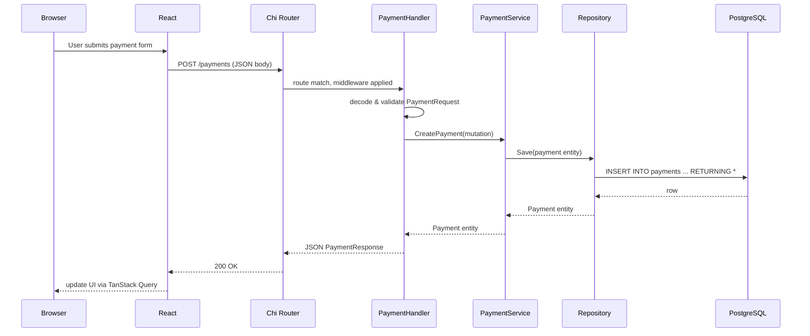

The Go Payment Dashboard is built as a three-tier application: a React frontend, a Go HTTP API, and a PostgreSQL database. Each tier has a clearly defined responsibility and communicates only through well-defined interfaces.

## System layers

<Columns cols={3}>
  <Card title="Frontend" icon="monitor" href="/architecture/frontend">
    React 19 + TypeScript SPA built with Vite. Communicates with the backend over HTTP using Axios and TanStack Query.
  </Card>
  <Card title="Backend" icon="server" href="/architecture/backend">
    Go HTTP API built with chi. Implements clean architecture: API handlers, application services, domain entities, and infrastructure.
  </Card>
  <Card title="Database" icon="database" href="/architecture/database">
    PostgreSQL with a `payments` table. Queries are written in SQL and compiled to type-safe Go code by sqlc.
  </Card>
</Columns>

## Request flow

The following shows the path of a `POST /payments` request from the browser to the database and back.

## Clean architecture in the Go backend

The backend follows a clean architecture pattern with four distinct layers. Dependencies point inward — outer layers depend on inner layers, never the reverse.

<Steps>
  <Step title="API layer (internal/api/)">
    Chi HTTP handlers decode incoming requests into typed request structs, validate input, and encode responses. This layer knows about HTTP but nothing about the database.
  </Step>
  <Step title="Application layer (internal/application/)">
    Service interfaces and implementations orchestrate business logic. Services accept query and mutation objects and return domain entities. They depend on repository interfaces, not concrete implementations.
  </Step>
  <Step title="Domain layer (internal/domain/)">
    Pure Go structs and constructor functions that represent business concepts. The `Payment` entity and repository interfaces live here. This layer has no external dependencies.
  </Step>
  <Step title="Infrastructure layer (internal/infrastructure/db/)">
    Concrete repository implementations using sqlc-generated code and pgx/v5. This layer satisfies the repository interfaces defined in the domain layer.
  </Step>
</Steps>

<Info>
The domain and application layers have no knowledge of HTTP or PostgreSQL. This makes them straightforward to unit-test in isolation using mocks or stubs.
</Info>

## Project structure

<Tree>
  <Tree.Folder name="cmd/api" defaultOpen>
    <Tree.File name="main.go" />
  </Tree.Folder>
  <Tree.Folder name="internal" defaultOpen>
    <Tree.Folder name="api" defaultOpen>
      <Tree.File name="payment.go" />
      <Tree.Folder name="request">
        <Tree.File name="payment.go" />
      </Tree.Folder>
      <Tree.Folder name="response">
        <Tree.File name="payment.go" />
      </Tree.Folder>
      <Tree.Folder name="mapper">
      </Tree.Folder>
      <Tree.File name="util.go" />
    </Tree.Folder>
    <Tree.Folder name="application">
      <Tree.Folder name="service" />
      <Tree.Folder name="interface" />
      <Tree.Folder name="query" />
      <Tree.Folder name="mutation" />
    </Tree.Folder>
    <Tree.Folder name="domain">
      <Tree.Folder name="entity">
        <Tree.File name="payment.go" />
      </Tree.Folder>
      <Tree.Folder name="repository" />
    </Tree.Folder>
    <Tree.Folder name="generated/sqlc" />
    <Tree.Folder name="infrastructure/db" />
    <Tree.Folder name="server">
      <Tree.File name="server.go" />
      <Tree.File name="routes.go" />
    </Tree.Folder>
  </Tree.Folder>
  <Tree.Folder name="sql">
    <Tree.Folder name="migration">
      <Tree.File name="payment.sql" />
    </Tree.Folder>
    <Tree.Folder name="query">
      <Tree.File name="payment.sql" />
    </Tree.Folder>
  </Tree.Folder>
  <Tree.Folder name="frontend/src">
    <Tree.Folder name="app" />
    <Tree.Folder name="features/payments" />
    <Tree.Folder name="components" />
    <Tree.Folder name="hooks" />
    <Tree.Folder name="types" />
  </Tree.Folder>
</Tree>

## Further reading

<Columns cols={3}>
  <Card title="Backend" icon="code" href="/architecture/backend">
    Chi router setup, layer-by-layer breakdown, request validation, and error handling.
  </Card>
  <Card title="Frontend" icon="layout" href="/architecture/frontend">
    Feature-based folder structure, TanStack Query, React Router, and component libraries.
  </Card>
  <Card title="Database" icon="database" href="/architecture/database">
    PostgreSQL schema, sqlc workflow, connection pooling, and query reference.
  </Card>
</Columns>
